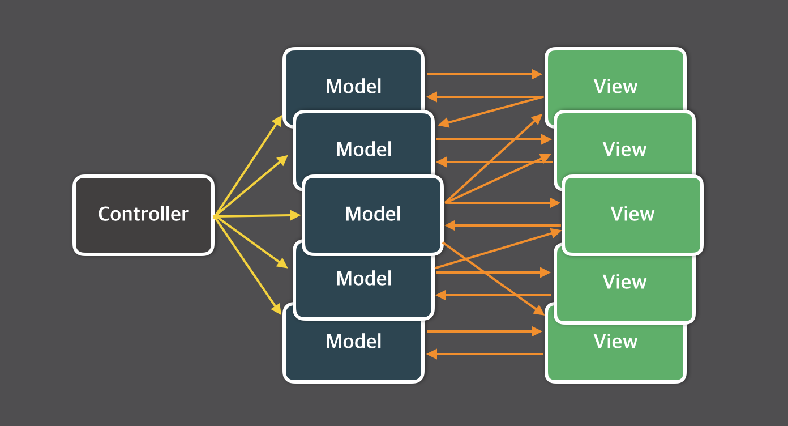

## ⤳ Flux 패턴
리덕스는 flux 패턴을 이용한 패키지이다. 

### 🤢 Flux 배경 : 기존 MVC 모델의 한계

대규모 어플리케이션에서 일관된 데이터 관리를 하기 위해 만들어젼다. 

기존에 보편적으로 사용되는 패턴은 MVC로, Model에 데이터 정의, Controller에 Model 데이터 CRUD, 변경된 데이터는 View에 출력되어 사용자에게 전달된다.


**단순 MVC 패턴**

이 패턴의 문제점은 어플리케이션의 규모가 커질수록 데이터 흐름이 너무 복잡해진다는 점이었다. 



**복잡한 MVC 패턴**

MVC 패턴은 데이터 변경사항을 신속하게 전파하기가 어렵다. 모델이 늘어날수록 전파 대상도 늘어나기 때문이다.  예를 들면 하나의 게시물이 있을 때, 게시물을 삭제하면 게시물에 연관된 댓글도 삭제되어야 하고 각 유저의 댓글 카운터나 사이트 헤더에도 변경사항이 전파되어야 한다. 

### 🤔 Flux 패턴


facebook은 이 문제를 해결하기 위해 flux 패턴을 제시했다. 양방향 데이터 흐름이 아닌 단방향으로만 데이터를 변경할 수 있도록하여 데이터 흐름이 단순해졌다.

### 📌 Action / Action Creator

액션은 데이터 상태를 변경할 수 있는 명령어 카드. 

### 📌 Dispatcher

디스패쳐가 액션 메시지를 감지하면 그것을 각 스토어에 전달한다. 콜백함수를 통해 전달되며 등록되어 있는 모든 스토어로 페이로드를 전달할 수 있다. 

### 📌 Store (Model)

스토어는 어플리케이션의 상태와, 상태 변경 메서드를 가지고 있다. 액션의 타입에 따라 메서드를 다르게 적용해 상태를 변경한다. 

### 📌 View

React에 해당하는 부분이다. 컨트롤러 뷰는 스토어에서 변경된 데이터를 가져와서 자식 뷰에게 데이터를 분배한다. 데이터를 넘겨받은 뷰는 화면을 새로 랜더링한다. 

## 🙅🏻‍♀️ Flux는 Redux와 다르다

리덕스가 전역 상태 관리에 많이 사용되고 있지만 기능에 비해 과한 타이핑을 요구해 불만이 생기고 있다. 리액트도 16.3 버전부터 Context API를 제공하고 있다. 

Redux는 flux 패턴을 그대로 구현한 것이 아니다. 핵심 철학에 있어서 flux와 다른 점이 많다. 

### 📌 Redux에 디스패쳐 개념이 없음

리듀서가 **디스패쳐와 스토어**의 기능 담당, 리덕스의 스토어는 뷰 전체를 wrapping하는 역할이다. 

이벤트 에미터로 작동하는 디스패쳐를 생략하고 리듀서가 각 액션 타입에 대한 메서드를 순수 함수로 구현하였고 리듀서가 관리하는 모든 상태를 immutable하도록 설정해서 기존의 상태에 overwirte가 아니라 새로운 객체로 복사되어 리턴된다. 각 리듀서는 서로를 의존할 수 없고 고립되어 있다. 

### 📌 Redux 스토어는 싱글턴 패턴을 따름

flux의 스토어가 각자 상태만 간직한 채 여럿으로 공존한 것과 달리 redux는 상태를 지니는 역할을 리듀서로 넘긴 뒤에 모든 리듀서가 하나의 스토어에 묶이도록 설계하였다. flux는 필요한 스토어에만 접근할 수 있었지만 redux는 무조건 하나의 스토어를 통해 각 리듀서에 접근할 수 있다. 

redux는 불변 데이터 컨셉으로 무결성을 보장하고 side-effect없이 상태를 업데이트하도록 강제한은 장점이지만 이를 위해 디스패쳐를 이용한 유연한 업데이트 방식을 포기하고 중앙집중형 스토어를 구현해 뷰가 데이터에 접근하는 방식이 번거롭게 만들었다.

### 💁🏻‍♀️ Context API

React 내부의 상태관리 툴이다. Redux보다 훨씬 작은 규모로 각 컴포넌트마다 개별적으로 운용할 수 있는 장점이 있다. 

요약: 기존 MVC 패턴의 데이터 흐름 복잡성때문에 단방향 데이터 흐름이 특징인 flux 패턴이 등장함. 이를 활용한 것이 redux이지만 redux의 단점때문에 context API와 같은 대안 방법이 등장하고 있음 

👉🏻 flux에 대한 더 자세한 설명 

[https://haruair.github.io/flux/docs/overview.html#content](https://haruair.github.io/flux/docs/overview.html#content)


```toc

```
